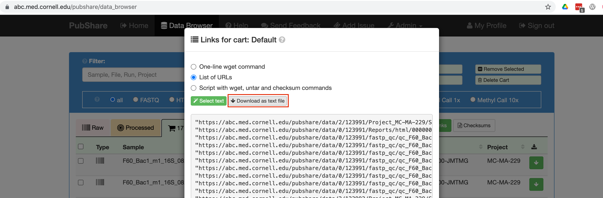

# pubshare-to-qiime2

Scripts for getting FASTQ files from Pubshare and running them through Qiime2

## Instructions

### Clone this repository

    git clone https://github.com/gputzel/pubshare-to-qiime2
    cd pubshare-to-qiime2
    chmod +x scripts/*.sh

The last command sets permissions on the scripts so that they are executable.

### Activate conda environment

If the required conda environment (`qiime2-2019.7`) is already installed, just activate it:

    conda activate qiime2-2019.7

To create this environment:

    wget https://data.qiime2.org/distro/core/qiime2-2019.7-py36-osx-conda.yml
    conda env create -n qiime2-2019.7 --file qiime2-2019.7-py36-osx-conda.yml
    rm qiime2-2019.7-py36-osx-conda.yml

### Download FASTQ files from Pubshare

    scripts/1-download-data.sh Pubshare_Default_URLs.txt

To get the file `Pubshare_Default_URLs.txt` do the following:

- Log into Pubshare and go to the Data Browser tab
- Create a new cart (or just delete/clear the Default cart and work with that instead)
- Select the Raw (FASTQ) files that you want
- Click on the green Links button
- Select the "List of URLs" option
- Click on the "Download as text file" button

### Make a sample manifest

    scripts/2-make-sample-manifest.py

Note that this script ends in `.py` unlike most of the other ones.

### Import data into Qiime2

    scripts/3-import-data-into-qiime2.sh

### Run dada2

    scripts/4-run-dada2.sh

This part could take a while, especially if you have a lot of samples.

### Filter out ASVs that are too short

    scripts/5-filter-out-short-ASVs.sh

### Make a phylogenetic tree

    scripts/6-make-phylogenetic-tree.sh

### Download pre-trained taxonomic classifier

    scripts/7-download-classifier.sh

**Please note that this classifier is specifically made for the primers that we use at the Microbiome Core**

### Classify the representative sequences

    scripts/8-classify-ASVs.sh

This can also take a while.

### Make a mapping file (sample data file)

    scripts/9-make-dummy-mapping-file.py

Now you can edit the resulting `mapping-file.tsv` as you see fit. You can add columns, for example. Be sure that it is still tab-separated!

### Get diversity stats

    scripts/10-diversity-stats.sh

### Make taxonomy barplots

    scripts/11-taxonomy-barplots.sh

